# 🎵 Basic Local Music Player (lightweight version of LocalWave)

A modern Android music player built with **Kotlin**, **Jetpack Compose**, **MVVM Architecture**, and **Media3 ExoPlayer**. The app scans and plays music stored locally on the device, providing a clean, responsive, and user-friendly listening experience with playlist management, favorites, and playback controls.

---

# 📚 Table of Contents

- [📱 App Overview](#-app-overview)
- [✨ Features](#-features)
- [🛠 Tech Stack](#-tech-stack)
- [🏗 Architecture](#-architecture)
- [🔄 App Flow](#-app-flow)
- [📸 Screenshots](#-screenshots)
- [🌐 API Integration](#-api-integration)
- [📂 Project Structure](#-project-structure)
- [🎯 Use Cases](#-use-cases)
- [🚧 Future Improvements](#-future-improvements)
- [💼 Freelancing & Portfolio](#-freelancing--portfolio)

---

# 📱 App Overview

## What is this app?

Basic Local Music Player is an offline Android music player that allows users to browse, manage, and play audio files stored on their device.

Built using modern Android development practices, the app focuses on performance, clean architecture, and an intuitive user experience while remaining lightweight and fully offline.

## Problem It Solves

Many music players are bloated with ads, unnecessary online features, and complex interfaces.

This application provides:

- Fast local music playback
- Clean and modern UI
- Offline-first experience
- Playlist and favorites management
- Smooth playback controls

---

# ✨ Features

### 🎵 Music Playback
- Play local audio files
- Play / Pause controls
- Next / Previous track navigation
- Seek through songs
- Display song metadata

### 📀 Album Art Support
- Automatically fetch album artwork from device storage
- Fallback artwork when unavailable

### ❤️ Favorites Playlist
- Mark songs as favorites
- Dedicated Favorites playlist
- Persistent favorite storage using DataStore

### 🔀 Playback Modes
- Shuffle playback
- Repeat One
- Repeat All
- Repeat Off

### 📱 User Experience
- Expandable Mini Player
- Full-screen Music Player
- Empty state handling
- Runtime permission handling
- Material Design 3 UI

### 💾 Persistence
- Favorites stored using Jetpack DataStore
- State restoration across app launches

### ⚡ Performance
- Offline-first
- Lightweight architecture
- Fast local media loading

---

# 🛠 Tech Stack

| Category | Technology |
|-----------|------------|
| Language | Kotlin |
| UI Toolkit | Jetpack Compose |
| Architecture | MVVM |
| Media Playback | Media3 ExoPlayer |
| State Management | StateFlow |
| Async Programming | Kotlin Coroutines |
| Persistence | Jetpack DataStore |
| Image Loading | Coil |
| Android APIs | MediaStore |
| Design System | Material 3 |

---

# 🏗 Architecture

This project follows the **MVVM (Model-View-ViewModel)** architecture pattern.

### Why MVVM?

- Clear separation of concerns
- Better maintainability
- Easier testing
- Lifecycle-aware state handling
- Scalable codebase

## Architecture Flow

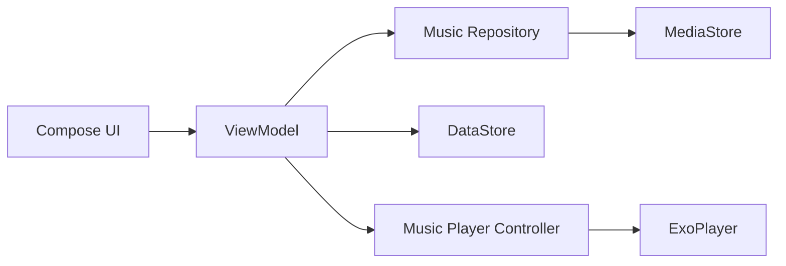

---

# 🔄 App Flow

### 1️⃣ Launch App

- App requests audio permissions
- Songs are loaded from MediaStore

### 2️⃣ Browse Songs

- User views all available songs
- Album art and metadata are displayed

### 3️⃣ Start Playback

- Tap a song
- ExoPlayer loads and plays the selected track

### 4️⃣ Control Playback

- Play / Pause
- Next / Previous
- Seek through audio

### 5️⃣ Manage Favorites

- Tap ❤️ on any song
- Song is added to Favorites playlist
- Favorites are persisted using DataStore

### 6️⃣ Switch Playlist

- Toggle between:
  - All Songs
  - Favorites

### 7️⃣ Continue Listening

- Shuffle and Repeat modes available
- Mini Player allows quick control from anywhere

---

# 📸 Screenshots 

## Home Screen

<p>
    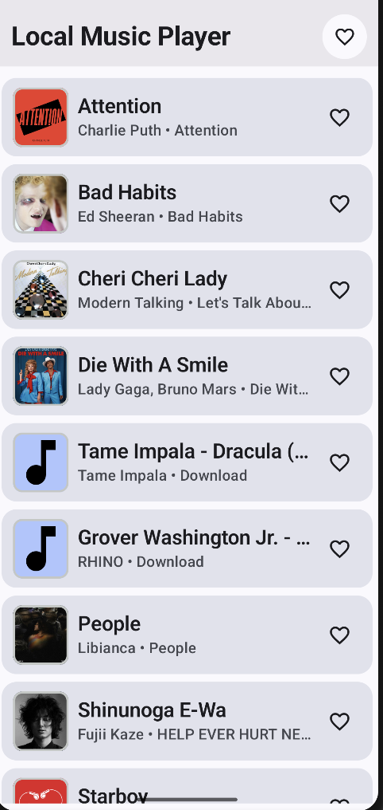
    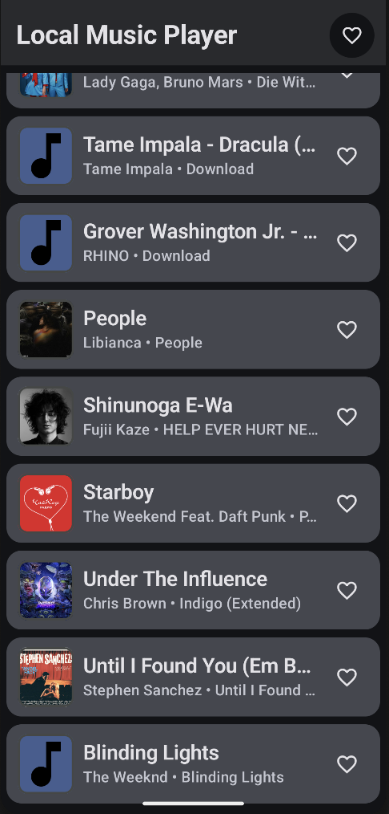
</p>

## Mini Player

<p>
    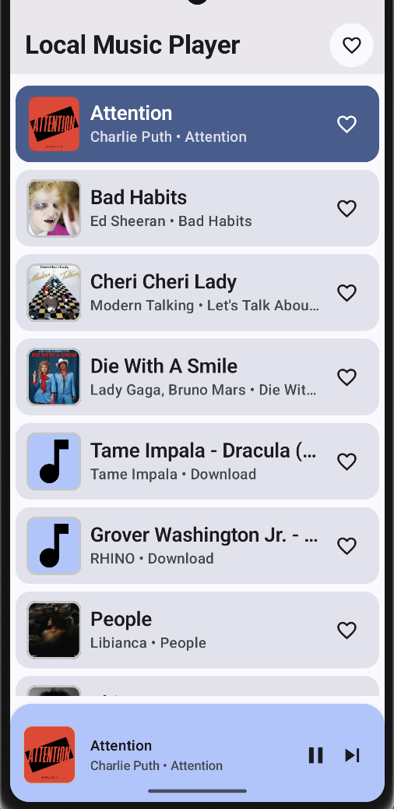
    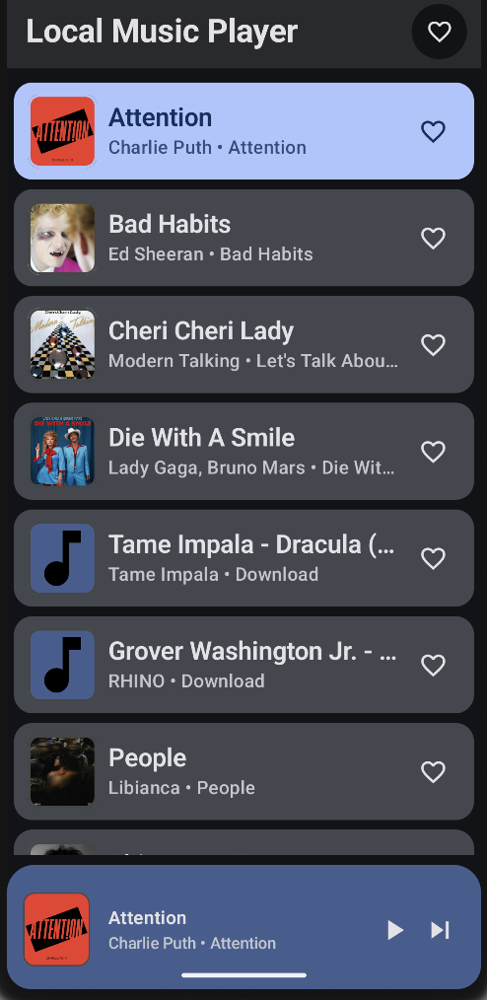
</p>

## Full Player Screen

<p>
    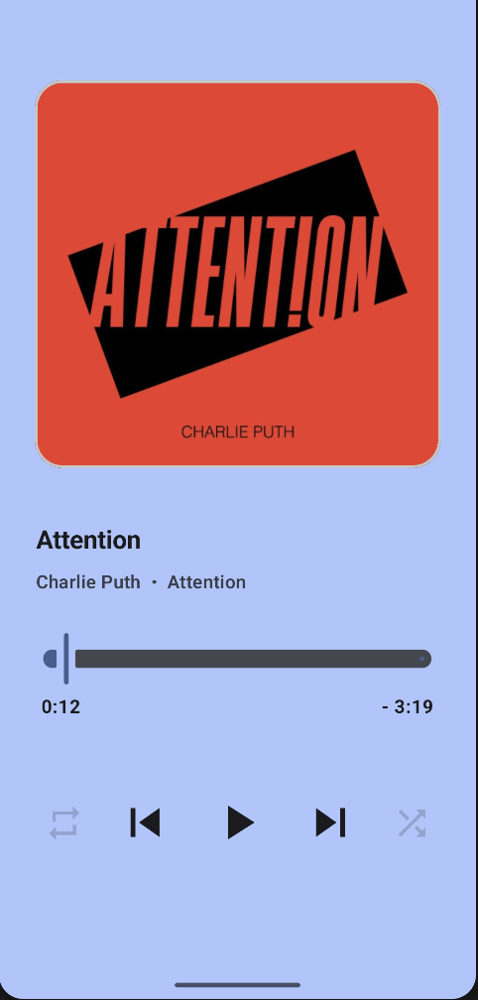
    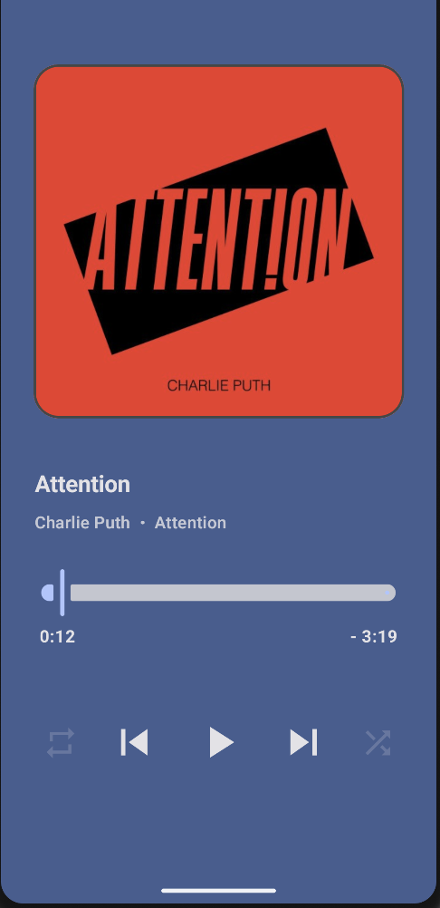
    <br>
    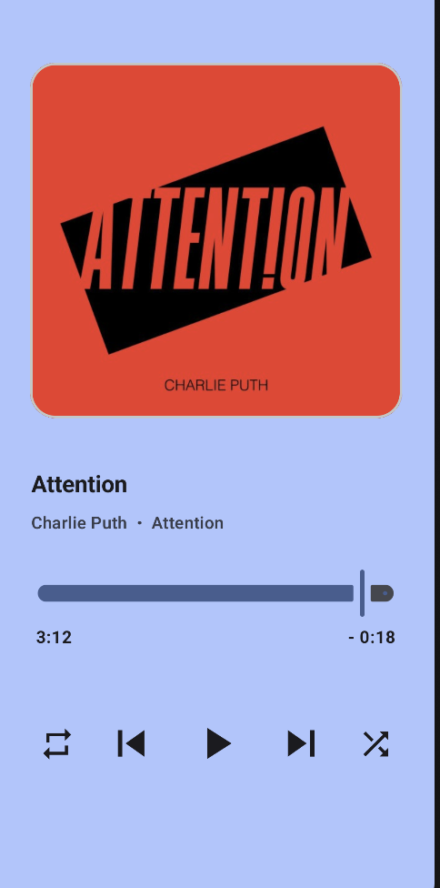
    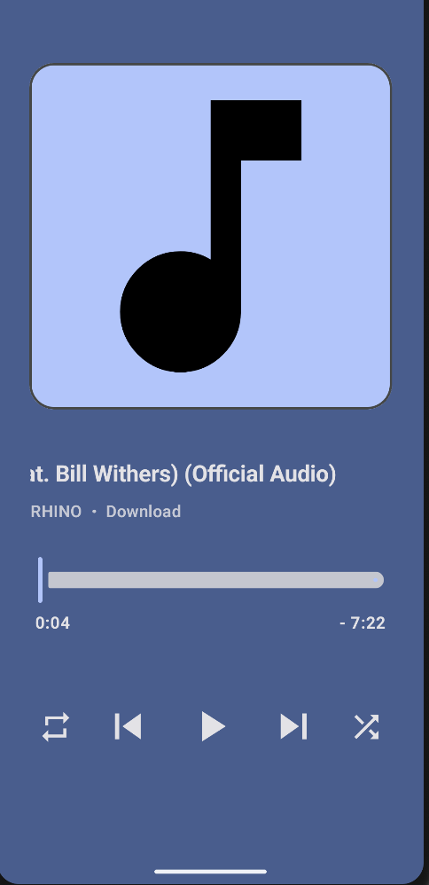
</p>

## Favorites Playlist

<p>
    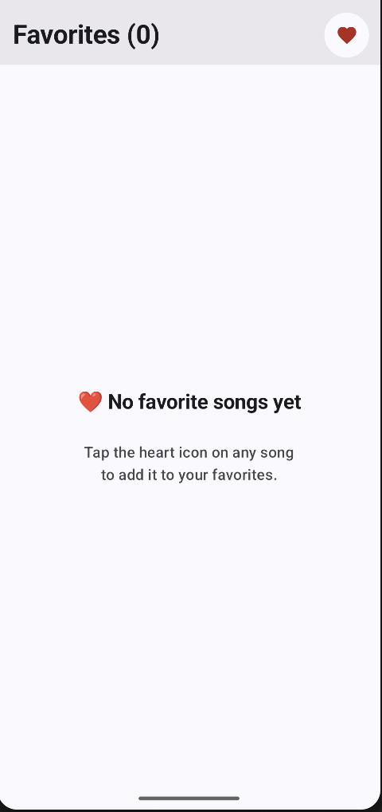
    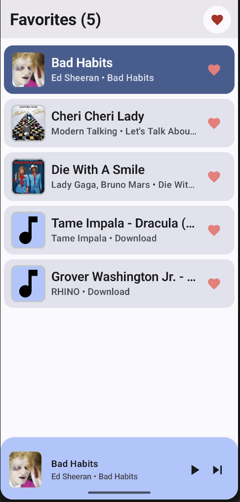
    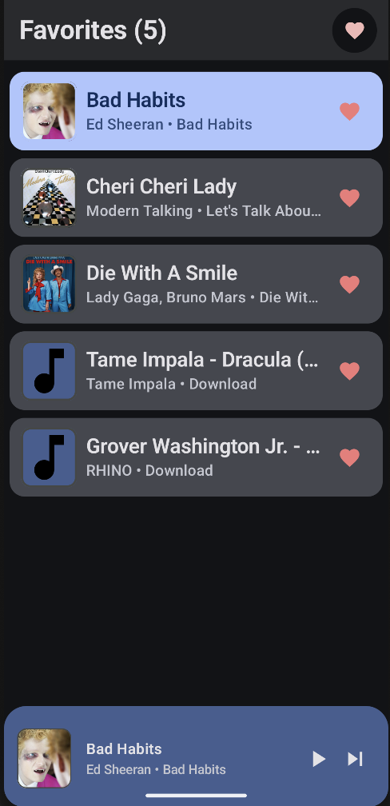
</p>

## Permission Launcher and Without Permission

<p>
    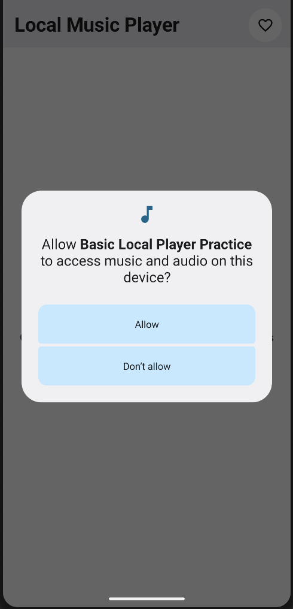
    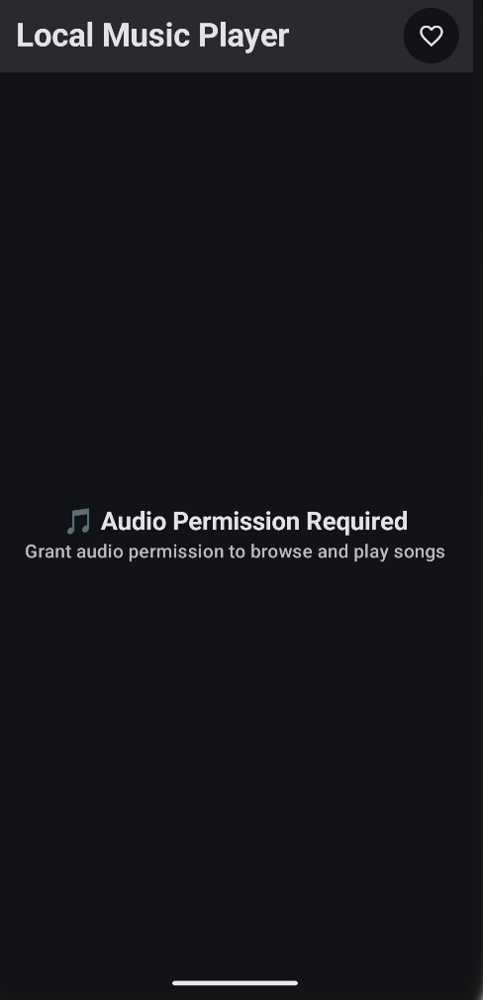
</p>

---

# 🌐 API Integration

## APIs Used

This project does not rely on external web APIs.

Instead, it uses Android's native APIs:

### MediaStore

Purpose:

- Query local audio files
- Retrieve metadata
- Access album artwork information

### DataStore

Purpose:

- Persist user preferences
- Store favorite songs

## Data Fetching Flow

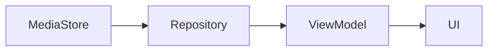

## Error Handling

- Runtime permission checks
- Fallback album artwork
- Empty state UI
- Safe null handling
- Graceful media loading failures

---

# 📂 Project Structure

```text
kush.android.basiclocalplayerpractice
│
├── data
│   ├── FavoritesDataStore.kt
│   └── MusicRepository.kt
│
├── model
│   ├── MusicUIState.kt
│   └── SongData.kt
│
├── player
│   └── MusicPlayerController.kt
│
├── utils
│   ├── PlaylistMode.kt
│   ├── RepeatModes.kt
│   └── PermissionUtils.kt
│
├── view
│   ├── HomeScreen.kt
│   ├── MusicPlayerScreen.kt
│   │
│   └── components
│       ├── MiniPlayer.kt
│       ├── MusicList.kt
│       ├── MusicListItem.kt
│       └── TopBar.kt
│
├── viewmodel
│   └── MusicViewModel.kt
│
└── MainActivity.kt
```

---

# 🎯 Use Cases

### 🎧 Daily Music Listening

Listen to locally stored songs without internet access.

### 🚶 Offline Travel

Enjoy music during flights, train rides, or areas with poor connectivity.

### 📚 Study Sessions

Create a favorites playlist for focused listening.

### 🏋️ Workout Music

Quickly access favorite workout tracks.

### 🔋 Lightweight Alternative

Ideal for users who prefer a minimal and ad-free music experience.

---

# 🚧 Future Improvements

### Planned Features

- Recently Played playlist
- Most Played songs
- Custom playlists
- Search functionality
- Sorting options
- Media notifications
- Lock screen controls
- MediaSession integration
- Foreground playback service
- Dynamic color themes
- Lyrics support
- Sleep timer
- Equalizer support
- Room Database integration
- Tablet optimization

---

# 💼 Freelancing & Portfolio

This project is part of my Android development portfolio and demonstrates modern Android development practices including:

- Jetpack Compose
- MVVM Architecture
- Media3 ExoPlayer
- Kotlin Coroutines
- StateFlow
- DataStore Persistence

I am open to freelance opportunities, Android development projects, and collaboration work.

If you would like to work together, feel free to reach out.

---

## ⭐ Support

If you found this project useful, consider giving it a star on GitHub. It helps support the project and encourages future development.
